Author: Sam Duffield

In the world of drones and IoT, the ability to control and monitor your devices from anywhere is a game-changer. Imagine having a drone in a remote location, sending back valuable data, and being able to manage it as if you were right there. This is where the power of MAVProxy and Balena comes in. By combining MAVProxy, a powerful ground control station for drones, with Balena, a platform for managing connected devices, you can create a robust and flexible system for remote drone operations.

An [example repostiory](https://github.com/samuel-duffield1/balena-mavproxy) can be found on my personal github profile.

-----

## What is MAVProxy?

MAVProxy is a fully-featured, command-line-based ground control station (GCS) for MAVLink-enabled drones. MAVLink is a lightweight messaging protocol for communicating with drones and their components. MAVProxy allows you to:

  * **Relay MAVLink messages:** It can act as a bridge between your drone's flight controller and other devices on a network.
  * **Run on-board scripts:** You can automate drone behavior with Python scripts that run directly on the GCS.
  * **Forward telemetry data:** Stream data from your drone to multiple other GCS applications or data-logging services.
  * **Extend functionality with modules:** MAVProxy has a modular architecture that allows you to add new features, such as custom maps, antenna trackers, and more.

Its lightweight and versatile nature makes it an ideal candidate for running on embedded systems and companion computers, which are often found on drones.

-----

## What is Balena?

Balena is a complete IoT platform that simplifies the process of developing, deploying, and managing fleets of connected devices. At its core, Balena provides:

  * **A container-based environment:** Your applications run in Docker containers, making them portable, scalable, and easy to manage.
  * **A robust OS:** BalenaOS is a minimal, secure, and reliable operating system designed specifically for running containers on embedded devices.
  * **Cloud-based management:** The BalenaCloud dashboard gives you a centralized view of all your devices, allowing you to monitor their health, push updates, and manage their software from anywhere in the world.
  * **Powerful networking:** Balena provides a public URL for each device, allowing you to access them remotely, even if they are behind a firewall or on a cellular network.

-----

## Putting Them Together: MAVProxy on Balena

By deploying MAVProxy as a container on a Balena-managed device, you can create a powerful and flexible remote GCS. Here’s how it would work:

1.  **The Hardware:** A companion computer, like a Raspberry Pi, is connected to your drone's flight controller. This device runs BalenaOS.
2.  **The Software:** You create a Docker container that includes MAVProxy and any other tools or scripts you need. This container is then pushed to the BalenaCloud and deployed to your device.
3.  **The Connection:** MAVProxy, running in its container on the device, communicates with the flight controller via a serial or network connection. It then forwards the MAVLink data to the internet via the BalenaCloud's VPN.
4.  **Remote Access:** From your computer, you can connect to the MAVProxy instance running on the drone's companion computer through the BalenaCloud public URL. This gives you full control over the drone and access to its telemetry data, as if it were connected directly to your machine.

### Data-Flow

### Block Diagram

-----

## Suggestions for Expansion

This is just the beginning. Here are a few ways this project could be expanded:

  * **Multi-drone management:** Use Balena's fleet management capabilities to control and monitor multiple drones at once.
  * **AI and Machine Learning:** Add another container to your Balena device to run AI and machine learning models for tasks like object detection or autonomous navigation.
  * **Custom Web Interface:** Create a web-based dashboard, running in its own container on the device, to provide a user-friendly interface for monitoring and controlling the drone.
  * **4G/5G Connectivity:** Add a cellular modem to your companion computer for truly long-range and remote operations.
  * **Data Logging and Analysis:** Stream telemetry data from MAVProxy to a cloud-based database or analytics platform for post-flight analysis.

-----

## Conclusion

The combination of MAVProxy and Balena offers a powerful and flexible solution for remote drone operations. By leveraging the container-based approach and cloud management capabilities of Balena, you can create a GCS that is not only robust and scalable but also easy to manage and update. Whether you're a hobbyist, a researcher, or a commercial drone operator, this setup has the potential to unlock a new world of possibilities for your drone projects. 🚁