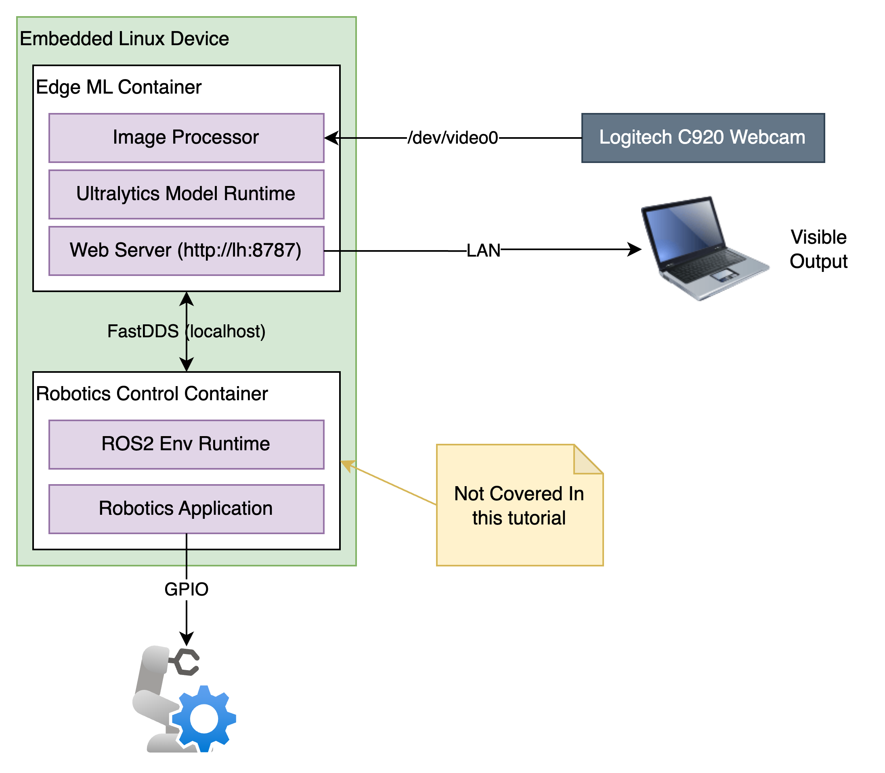
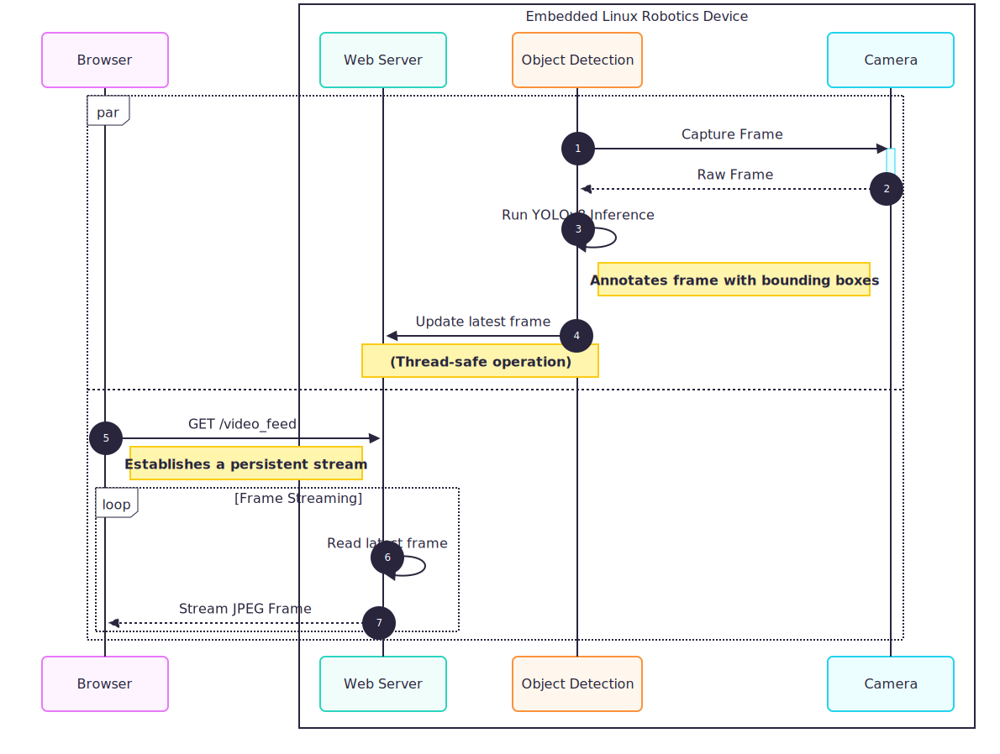
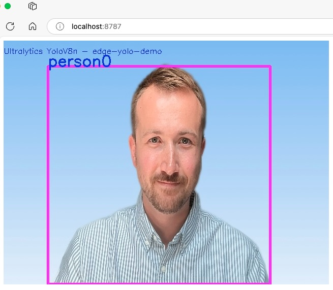

Author: Sam Duffield

Bringing machine learning to your edge computer vision projects is more accessible than ever. For any modern robot or smart device, the ability to observe, detect, and act on its surroundings is becoming a critical feature.

These are my personal notes on how to quickly bootstrap an object detection application in  Robotics projects.  This guide deliberately **does not share project-complete source code**, rather code-snippets to aid your thinking & shape your own solution. In my experience, it is rarely lack of source code that slows a project down, but rather dependancy-conflicts &/or poor implementation architectures. This guide will hopefully nudge you in the right direction.

This guide shares the core-components to combine the power of OpenCV and an Ultralytics YOLOv8 model. Additionally, with [Balena](https://www.balena.io/), you can deploy & manage a robust and scalable solution across a fleet of devices, making it ideal for hobbyists and professionals alike. Why containers? You'll find many arguments for the use of containers for software deployment (& development) out there on the web. For robotics projects & Edge AI, they provide a great way to isolate your dependancies in a network-secure environment in a packaged artefact that you can ship between devices & targets with ease.

For simplicity & rapid iteration/development, this guide uses Python 3.11. Python is a great language for iteration of unrefined ideas to build concept demonstrators for VC's and investors, and leverages several accelerated libraries & runtimes written in C and Rust under the hood.
## Software BoM
- **Balena:** An all-in-one platform for managing your fleet of connected devices. [BalenaOS](https://www.balena.io/os), a minimal Linux distribution, is optimized for running Docker containers. BalenaCloud allows you to build, deploy, and manage your applications remotely. This means you can update your device's software with a simple `balena push`. Read the Getting Started guide [here](https://docs.balena.io/learn/getting-started/raspberrypi5/python/).
- **OpenCV:** The Swiss Army knife of computer vision. This open-source library provides a vast array of tools for image and video analysis. We'll use it to capture video from a camera and preprocess it for our object detection model.
- **Ultralytics (YOLOv8):** Ultralytics provides highly efficient and accurate object detection models. YOLOv8 is a robust iteration, offering state-of-the-art performance, making it perfect for resource-constrained edge devices.

## What You'll Need
To bring up a fleet-managed robotics project complete with machine vision, you'll need the following:
- **A supported embedded Linux device:** A Raspberry Pi 5 is an excellent choice for its recent CPU performance enhancements, and the ability to integrate hardware accelerators such as the Hailo-8 (future guides!).
- **A compatible camera:** A USB webcam or the Raspberry Pi Camera Module will work perfectly.    
- **A free BalenaCloud account:** Sign up at [balena.io](https://www.balena.io/).    
- **The Balena CLI tool:** Installation instructions can be found in the [Balena documentation](https://www.balena.io/docs/reference/cli/).    
- **A local development environment with Git and Docker installed.**

## Solution Architecture
Many edge-deployed machine vision projects, especially robotics projects, will have a camera connected, but not a screen. Hence, `flask` is recommended to build a small web-server to serve images to network devices on the same local network. Additional security options could be provided, such as encrypted images or authentication, but these are beyond the scope of this article.

For sharing classification output with your robotics application, FastDDS (or other DDS implementations) is recommended to interface with the ROS2 environment your robotics control application is running in. A full robotics control application is beyond the scope of this article, but may be covered in a future guide.



## Code Dependancies
Your Python project will require the following dependancies.
If you work in a commercially sensitive environment it's a great idea to vendor these dependancies locally, or self-host a package manager:
```txt
opencv-python == "4.9.0.80"
tensorflow == "2.16.1"
tensorflow-hub == "0.16.1"
ultralytics == "8.2.75"
flask == "3.0.2"
pillow == "10.4.0"
```

## The Camera (OpenCV via `libcamera`)
There are *hundreds* of tutorials on how to use OpenCV in Python with a camera connected to a linux device. I recommend the following:
* [Control your Webcam with Python - OpenCV Beginners Tutorial](https://youtu.be/sd25t4HmFdU)
* [Capture Video from Camera using Python OpenCV](https://youtu.be/rICplpK28SI)
* [How to Capture an Image From a Webcam Using Python OpenCV](https://youtu.be/5ZrtPi-7EN0)

However, what I would advise is reading the documentation on how the image should be Transformed to align with the dimensions the the model tensors are expecting.

Such a transformation in code may look as follows (to 640 x 480 pixel format):
```python
# Decode JPEG frame data to OpenCV image format
data = numpy.array(original_image.data)
img = cv2.imdecode(buf=data, flags=cv2.IMREAD_COLOR)
# Resize image to standard input size for YOLOv8 model
img = cv2.resize(img, (640, 480), interpolation=cv2.INTER_LINEAR)
# Perform inference with streaming results for memory efficiency
results = self.model(img, stream=True, verbose=False)
for result in results:
	# Process COCO results...
```

## The Model (Yolo)
You can download the `yolov8n.pt` model offline [here](https://docs.ultralytics.com/models/yolov8/#performance-metrics). I recommend the `v8n` model for Edge Compute devices, due to its reduced `FLOP` (Floating Point Operations) & consequently reduced CPU speed on compute-restrained devices typically found on Embedded Linux devices.

I  would advice you structure your application to such that you contain the model within a data structure, with member-methods to perform appropriate operations (such as `def perform_classification(self, image :Image) -> output`):

```python
from ultralytics import YOLO

# Directory path to external model file
EXTERN_FILES_DIR = os.path.join(os.path.dirname(os.path.realpath(__file__)), "assets", "Ultralytics")

class UltralyticsYolov8n:
    """
    YOLOv8 Nano object detection model implementation using Ultralytics.

    This class provides a wrapper around the Ultralytics YOLOv8 nano model
    for real-time object detection. 
    """

    def __init__(self) -> None:
        """
        Initialize the YOLOv8 nano model.

        Loads the pre-trained YOLOv8 nano model from the assets directory
        and sets up the model configuration for inference.

        Raises:
            FileNotFoundError: If the yolov8n.pt model file cannot be found
            RuntimeError: If the model fails to initialize
        """
        # Load the YOLOv8 nano model with verbose output disabled
        self.model = YOLO(os.path.join(EXTERN_FILES_DIR, "yolov8n.pt"), verbose=False)
        self.model_name = "Ultralytics YoloV8n"
        return
        
    def perform_classification(self, image) -> Output:
	    """
	    Your Code here!
	    """
```

## The Display (Flask WebServer)
Displaying your image using a webserver **should be done concurrently** to not slow the inference-loop of your model. A rough idea of how this can be achieved is shown below:




* **1. Capture Frame:** The dedicated **Object Detection** thread requests a new image from the **Camera**.
* **2. Raw Frame:** The **Camera** provides a single, raw image frame back to the **Object Detection** thread.
* **3. Run YOLOv8 Inference:** The **Object Detection** thread processes the frame internally. It uses the Ultralytics model to find objects and then draws visualization boxes and labels directly onto the image.
* **4. Update latest frame:** The **Object Detection** thread places the newly processed (annotated) frame into a shared variable that the **Web Server** can access. This update is thread-safe to prevent conflicts.
	* You may want to implement a circular buffer in your own `WebServer` implementation to prevent slowing bottlenecks imposed by the Browser's web connection.
* **5. GET /video\_feed:** A user opens your device's IP address in their **Browser**, which sends a request to the **Web Server** to start streaming the video feed.
* **6. Read latest frame:** The **Web Server** thread continuously reads the most recent annotated frame from the shared variable.
* **7. Stream JPEG Frame:** The **Web Server** sends the image frame to the **Browser**. This action repeats in a loop (steps 6 and 7), creating a live video stream for the user.
## Dockerfile and Compose
For Python-based OpenCV project, dependancies managed by the `apt` package-manager are minimised. This is because the `opencv-python` pypi package includes many of the pre-compiled runtime `.so` libraries that OpenCV depends on.

Dockerfile:
```dockerfile
FROM python:3.11

WORKDIR /app
COPY . .

# Install system dependencies
RUN apt-get update && apt-get install -y \
    build-essential \
    libgl1-mesa-glx \
    libglib2.0-0 \
    git

RUN python -m venv venv
RUN git init
RUN venv/bin/pip install .

# CMD Variable for your application
CMD ["/app/venv/bin/python", "/app/your-application-here.py"]
```

docker-compose.yml:
```yaml
version: "2"

services:
  app:
    build:
      context: .
      dockerfile: containers/Dockerfile
    ports:
      - "8787:8787"
    devices:
	    - "/dev/video0:/dev/video0" # Map the camera device into the container
```

## Result
By combining a YoloV8 model, a camera and a display in a containerised environment as described above, you too should be able to bootstrap your robotics project with machine vision!

