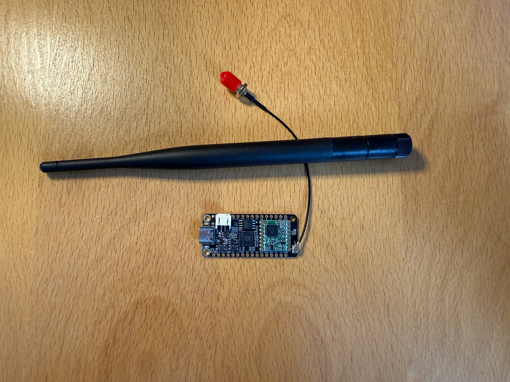
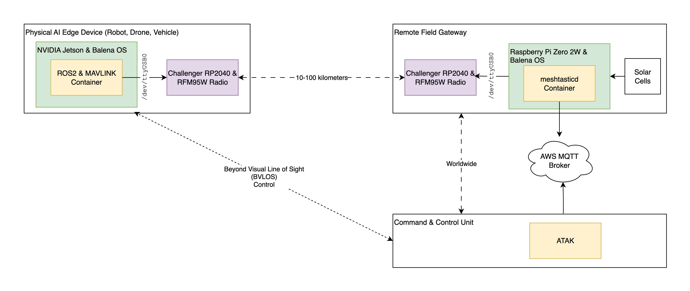
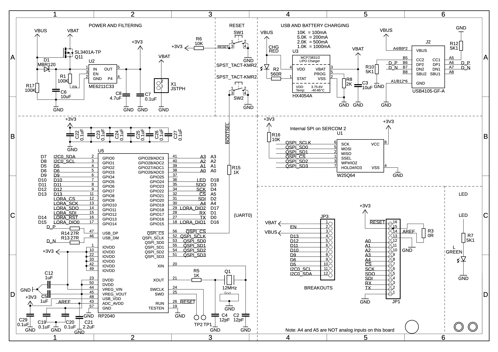
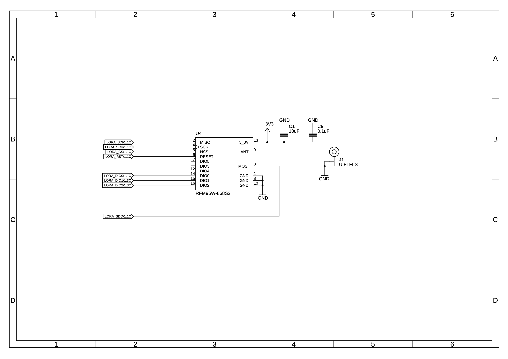

Author: Sam Duffield

## Context

I've recently had many friends & colleagues raving about [Meshtastic](https://meshtastic.org/), an Open Source Mesh-Radio Communications System that uses the 433Mhz & 868Mhz PHY ISM bands to exchange data. The great thing about **ISM (Industrial, Scientific, and Medical) bands** is that they are internationally reserved for these purposes, meaning you can use them without needing an expensive license.

Combine this with a side project I've been working on (Beyond Visual Line of Sight (BVLOS) Control of a Robot for under £100)... I thought there's a perfect combination of technology to experiment with. For those unfamiliar, **BVLOS** simply means operating the drone or robot beyond your ability to see it with your own eyes, a crucial capability for any serious long-range application.

## Intro to Meshtastic

If you were manufacturing a Drone for a defence company, you would have to budget at least £5,000 for a [MANET Meshnet Radio](https://www.dtccodan.com/products/sdr-h2-2). **MANET, or Mobile Ad Hoc Network**, refers to a self-healing, decentralized network where each node can relay data. This is essential for military and emergency services where there's no reliable infrastructure. Project costs & procurement challenges would quickly spiral into the £100,000's before you even start the design & build of your robot.

[Meshtastic](https://meshtastic.org/) is an open source, off-grid, decentralized, mesh network built to run on affordable, low-power devices. The 1 kit for one radio costs ~£25. Individual components for a PCB could go as low as £3 (for mass procurement purchase).

There exists pre-assembled Meshtastic kits you can buy from Amazon... such as the [Heltec LoRa 32 V3](https://meshtastic.org/docs/hardware/devices/heltec-automation/lora32/), but I didn't want the overhead power consumption of a pre-soldered LCD screen... nor did I want/need BLE Connectivity for smartphone pairing either.

My project will eventually be boiled down to a Single 2-layer PCB... so the [Challenger RP2040 868MHz LoRa](https://thepihut.com/products/challenger-rp2040-lora-868mhz) seemed like the perfect dev kit board, especially as its [schematics are open source](https://gitlab.com/invectorlabs/hw/challenger_rp2040_lora).

The intent will be to connect the radio over UART to my robotics controller, to seperate concerns (keep signal processing of radio comms isolated from robotic control algorithms) and simplify the design.

Using a combination of Meshtastic, **MAVLINK (Micro Air Vehicle Link)**, a lightweight messaging protocol for drones, and **MQTT (Message Queuing Telemetry Transport)**, a simple and effective protocol for IoT devices, I should be able to operate my Robot anywhere in the world, as long as it maintains connection with **any publically available remote field gateway**.
Services such as [`meshtasticd`](https://www.google.com/search?q=%5Bhttps://meshtastic.org/docs/software/linux/installation/%5D\(https://meshtastic.org/docs/software/linux/installation/\)) can be configured to forward on encrypted meshtastic messages onto a public MQTT broker. This could be any remote Meshtastic Node that someone has deployed, not just me. Deploying a node running from solar cells can be achieved for under £100.

A system block diagram of how this could be achieved is below. Better yet, Meshtastic integrates support for [ATAK](https://meshtastic.org/docs/software/integrations/integrations-atak-plugin/) right out of the box. **ATAK (Android Team Awareness Kit)** is a powerful geospatial mapping and situational awareness tool used by military and first responders, so having this integration available for a hobbyist project is incredible.

## Adding Board Support to Meshtastic

There was just one problem though with the Challenge RP2040 LoRa though... it wasn't yet supported by Meshtastic... so a perfect opportunity to contribute to the firmware with a board support package (BSP).

Schematics are [provided for the board](https://gitlab.com/invectorlabs/hw/challenger_rp2040_lora). Instructions on how to add board support packages is well detailed on the [meshtastic documentation](https://meshtastic.org/docs/development/firmware/build/).

There's an easy way to obtain a pre-written pinout for community/hobbyist dev kits, and that's to check whether there's an [Arduino Core](https://store.arduino.cc/collections/core-family) written for the device. An **Arduino Core** is essentially the software package that translates the standard Arduino functions (like `digitalWrite()` and `analogRead()`) into instructions that a specific microcontroller, in this case the RP2040, can understand.

I've worked with supporting RP2040 devices on the Arduino Framework before, and [Earle Philhower has long been the maintainer of the arduino-pico core on GitHub](https://github.com/earlephilhower/arduino-pico/blob/master/variants/challenger_2040_lora/pins_arduino.h).

This meant it was a fairly trivial exercise to add a `variant.h` file with the correct pinout to enable the board within the firmware ([see Pull Request](https://github.com/meshtastic/firmware/pull/7826/files)).

And that's it\! You can build the firmware & flash it to your own Challenger RP2040 if you so wish by following the [build instructions](https://meshtastic.org/docs/development/firmware/build/) on your development machine. 

It's a testament to the power of open source that you can take an unsupported board and, with a little digging, get it running with a complex and powerful firmware like Meshtastic. Happy meshing!